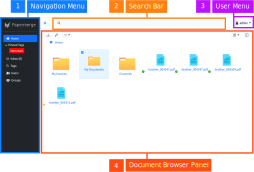

User Interface
===============

|project| comes with a simple and intutive user interface (UI) layout. The UI
is devided into four areas:

1. Navigation Menu - contains different views like tags, users, groups, inbox
2. Search Bar - quick search of any document
3. User Menu - contains user preferences, API tokens and other menu items.
4. Document Browser Panel - main area for browsing documents and folders

    Figure 1. User interface layout

.. _ui_dual_panel_mode:

Dual Panel Mode
~~~~~~~~~~~~~~~

Document browser (in figure 1. marked with number 4.) is designed to have
similar look and feel of modern desktop file browsers. This is the place
where you browse your documents and folders.

In order to assist you to quickly move around documents, folders and pages -
document browsers can be switched to *dual panel model* - in this mode there
are two panels displayed side by side. Between two panels documents (as well
as folders and pages) can be moved with one simple drag'n drop. Figure
below shows document browser toggled in dual panel mode:

.. figure:: ../img/user-manual/user-interface/ui-dual-panel-mode.svg

    Figure 2. Document browser toggled in dual panel mode

In order to switch to dual panel mode, use document browser's upper right button:

.. figure:: ../img/user-manual/user-interface/switch-to-dual-panel-mode.svg
