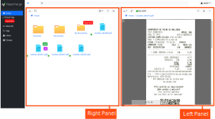
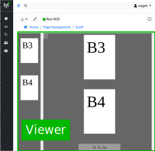

User Interface
===============

|project| comes with a simple and intutive user interface (UI) layout. The UI
is devided into four areas:

1. Navigation Menu - contains different views like tags, users, groups, inbox
2. Search Bar - quick search of any document
3. User Menu - contains user preferences, API tokens and other menu items.
4. Commander Panel - or Commander - area for browsing documents and folders

    Figure 1. User interface layout

.. _ui_dual_panel_mode:

Dual Panel Mode
---------------

Commander (in figure 1. marked with number 4.) is designed to have
similar look and feel of modern desktop file browsers. This is the place
where you browse your documents and folders.

In order to assist you to quickly move around documents, folders and pages -
there is a special mode - *dual panel model*. In dual panel mode there
are two panels displayed side by side. Between two panels documents (as well
as folders and pages) can be moved with one simple drag'n drop. Figure
below shows how dual panel mode looks like:

    Figure 2. Dual panel mode - displays two panels side by side

In order to switch to dual panel mode, use Commander's upper right button:

    Figure 3. Switching to dual panel mode

To switch back to single panel mode, use close button - which is in the upper right
corner of one of the panels:

    Figure 4. Switching to single panel mode

.. note:: Close button will be displayed only on one of the panels.
   Although both panels look and feel exactly the same, internally
   application still distinguishes them as main and secondary one. Main panel
   is the one which is always visible and secondary panel is the on which
   opens and closes i.e. the one with "close button" in upper right corner.

.. _Commander:

Commander
---------

Commander or Commander Panel is one of the two available panels. Commander is
the panel which shows documents and folders - modern web based file browser if
you will.

.. figure:: ./user_interface/one_commander.svg

    Figure 5. Commander

    Figure 6. Two Commanders

.. note:: The name "Commander" is in line with naming scheme of very popular dual panel
    mode applications like `Norton Commander`_, `Total Commander`_ and `Double Commander`_.
    Obvisouly in |project| context, "Commander" is not a separate application, it is
    the name "file browser" panel.

.. _Viewer:

Viewer
------

Viewer or Viewer Panel or Document Viewer is one of the two available panels.
Viewer is the panel in which document is opened.

    Figure 7. Viewer. In this figure only one viewer is opened.

There can be two Viewers opened side by side. This mode (i.e. dual panel mode
with a Viewer in each panel) is very handy when it comes to moving
pages between documents.

.. figure:: ./user_interface/two_viewers.svg

    Figure 8. Two Viewers. In other words - this is dual panel mode with a Viewer in each panel.

.. _Thumbnails_Panel:

Thumbnails Panel
~~~~~~~~~~~~~~~~

Document viewer features a thumbnails panel which can be toggles on and off.
Pages can be selected only inside thumbnails panel.

.. figure:: ./user_interface/thumbnails_panel.svg

    Figure 9. Thumbnails panel of the Document Viewer.

Context Menu and its Peculiarity
--------------------------------

First of all, |project| features a context menu, which may be invoked
only when your mouse pointer hovers over Commander or Viewer.

Pay attention to the animated image below, the |project| specific context menu
will appear only when you click over Commander or Viewer, otherwise the
default browser's built in context menu will be displayed::

.. _Norton Commander: https://en.wikipedia.org/wiki/Norton_Commander
.. _Total Commander: https://en.wikipedia.org/wiki/Total_Commander
.. _Double Commander: https://en.wikipedia.org/wiki/Double_Commander